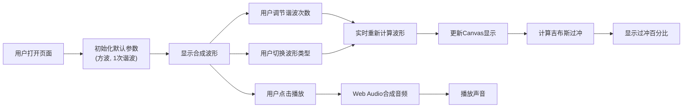

## 1. 产品概述
傅里叶级数波形合成器是一个交互式数学可视化工具，通过谐波叠加演示傅里叶级数如何合成各种波形。
- 核心目的：帮助用户直观理解傅里叶级数原理，观察吉布斯现象等数学特性
- 目标用户：学生、教师、数学爱好者、音频工程师
- 产品价值：将抽象的数学概念转化为可视化、可听化的交互体验

## 2. 核心功能

### 2.1 用户角色
| 角色 | 注册方式 | 核心权限 |
|------|----------|----------|
| 普通用户 | 无需注册 | 使用所有可视化和音频功能 |

### 2.2 功能模块
1. **波形合成控制面板**：谐波次数调节、波形类型切换
2. **实时波形可视化**：合成波形显示、谐波叠加过程展示
3. **吉布斯现象展示**：过冲百分比实时计算与显示
4. **音频合成模块**：Web Audio播放合成波形声音

### 2.3 页面详情
| 页面名称 | 模块名称 | 功能描述 |
|----------|----------|----------|
| 主页面 | 控制面板 | 谐波次数滑块(1-50)、波形类型选择(方波/三角波/锯齿波) |
| 主页面 | 波形显示区 | Canvas绘制合成波形、各次谐波分量、叠加过程 |
| 主页面 | 吉布斯现象面板 | 显示当前过冲百分比、理论值对比 |
| 主页面 | 音频控制区 | 播放/暂停按钮、音量调节 |

## 3. 核心流程
用户打开应用后，可调节谐波次数滑块观察波形变化，切换不同波形类型，点击播放按钮聆听合成声音。

## 4. 用户界面设计

### 4.1 设计风格
- 主色调：深蓝科技感 (#1a1a2e) 搭配霓虹青色 (#00d9ff)
- 辅助色：品红 (#ff0080)、金黄 (#ffd700) 用于区分不同谐波
- 按钮风格：圆角矩形、悬浮发光效果
- 字体：JetBrains Mono（等宽字体，适合数据展示）+ Space Grotesk
- 布局风格：卡片式布局、深色主题、网格对齐
- 图标风格：简约线性图标，搭配霓虹边框

### 4.2 页面设计概览
| 页面名称 | 模块名称 | UI元素 |
|----------|----------|--------|
| 主页面 | 标题区 | 大字体标题、副标题说明、渐变文字效果 |
| 主页面 | 控制面板 | 卡片容器、滑块控件、下拉选择器、实时数值显示 |
| 主页面 | 波形画布 | Canvas元素、网格背景、坐标轴、多色波形曲线 |
| 主页面 | 数据面板 | 吉布斯过冲数值、动画效果、理论值对比条 |
| 主页面 | 音频控制 | 播放按钮动画、音量滑块、波形可视化指示器 |

### 4.3 响应式
- Desktop-first设计，优先保证大屏幕体验
- 移动端自适应布局，控件垂直排列
- Canvas响应式缩放，保持清晰度
- 触摸设备优化滑块和按钮尺寸

### 4.4 动画与交互
- 波形绘制平滑过渡动画
- 谐波叠加过程逐步展示
- 滑块调节时实时反馈
- 播放按钮脉冲动画效果
- 吉布斯数值变化动态过渡
