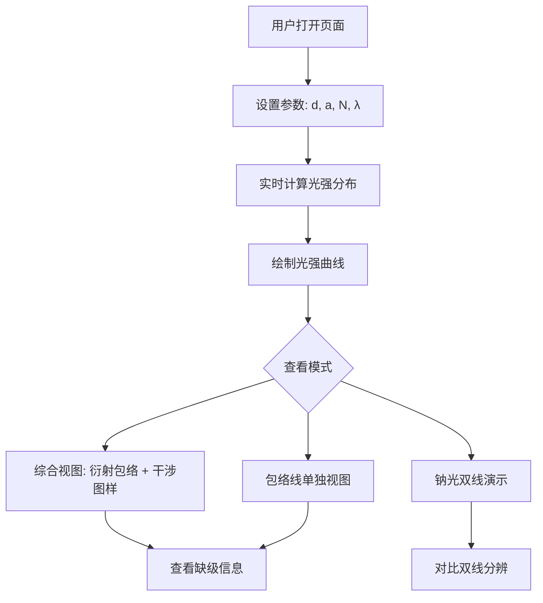

## 1. 产品概述

光栅衍射模拟器是一个基于 Web 的交互式物理光学可视化工具，用于演示多缝干涉与单缝衍射的叠加效应。用户可调节光栅常数、缝宽、缝数和入射波长，实时观察光强分布曲线、缺级现象及钠光双线分辨效果。

- 目标用户：物理学习者、光学课程教师、物理爱好者
- 核心价值：将抽象的光栅衍射理论转化为直观、可交互的视觉体验

## 2. 核心功能

### 2.1 功能模块

1. **模拟主页面**：参数控制面板、光强分布曲线图、缺级信息面板、包络线单独视图
2. **钠光双线演示**：双波长叠加对比视图

### 2.2 页面详情

| 页面名称 | 模块名称 | 功能描述 |
|----------|----------|----------|
| 模拟主页面 | 参数控制面板 | 滑块/输入框设置 d（μm）、a（μm）、N（1-10）、λ（nm），实时更新曲线 |
| 模拟主页面 | 光强分布曲线图 | Canvas 绘制相对光强 I/I₀ vs 角度 θ，叠加单缝包络线（虚线），标注主极大位置 |
| 模拟主页面 | 缺级信息面板 | 根据参数计算并展示缺级级次列表，高亮标注在曲线图上 |
| 模拟主页面 | 包络线单独视图 | 可切换显示单缝衍射包络线独立视图（无干涉调制） |
| 钠光双线演示 | 双线对比视图 | 同时显示 λ=589nm 和 λ=589.6nm 的光强曲线，展示瑞利判据分辨极限 |

## 3. 核心流程

用户打开页面 → 调整光栅参数（d、a、N、λ）→ 系统实时计算并绘制光强分布曲线 → 用户查看主极大与缺级信息 → 可切换至包络线单独视图 → 可进入钠光双线演示模式

## 4. 界面设计

### 4.1 设计风格

- 配色：深色科学主题（深蓝灰背景 #0f172a），曲线用亮色突出（青色 #22d3ee 主极大，琥珀色 #f59e0b 包络线，玫瑰红 #f43f5e 钠光双线对比色）
- 字体：数据标签使用 JetBrains Mono 等宽字体，界面文字使用 Noto Sans SC
- 布局：左侧参数面板 + 右侧大面积曲线图区域，响应式布局
- 交互：滑块拖动实时刷新，hover 显示角度/光强数值，缺级级次高亮标记

### 4.2 页面设计概览

| 页面名称 | 模块名称 | UI元素 |
|----------|----------|--------|
| 模拟主页面 | 参数控制面板 | 深色卡片容器，标签+滑块+数值输入，分组排列 |
| 模拟主页面 | 光强分布曲线图 | Canvas 画布，坐标轴带刻度标注，曲线平滑渲染，图例 |
| 模拟主页面 | 缺级信息面板 | 卡片内标签列表，缺级级次用高亮色标记 |
| 模拟主页面 | 包络线切换按钮 | 切换开关组件，控制包络线独立视图显示 |
| 钠光双线演示 | 双线对比视图 | 双波长曲线叠加画布，不同颜色区分，图例标注波长值 |

### 4.3 响应式设计

- 桌面优先设计，大屏左右分栏布局
- 中等屏幕参数面板折叠为顶部水平栏
- 小屏幕全宽堆叠布局

## 5. 物理公式

- **单缝衍射强度**：I_s(θ) = [sin(β)/β]²，其中 β = πa·sinθ/λ
- **多缝干涉强度**：I_N(θ) = [sin(Nφ/2)/sin(φ/2)]²，其中 φ = 2πd·sinθ/λ
- **总强度**：I(θ) = I_s(θ) × I_N(θ)
- **主极大条件**：d·sinθ = mλ（m = 0, ±1, ±2, ...）
- **缺级条件**：m = k·(d/a)，其中 k 为非零整数且 d/a 为整数比
