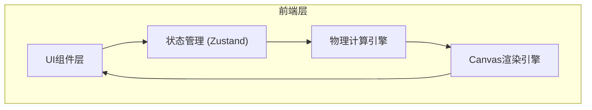

## 1. 架构设计



纯前端架构，无后端依赖。所有物理计算在浏览器端完成。

## 2. 技术选型

- 前端框架：React 18 + TypeScript
- 样式方案：Tailwind CSS 3
- 构建工具：Vite
- 状态管理：Zustand
- 图表渲染：原生 Canvas API（高性能自定义绘制）
- 初始化模板：react-ts

## 3. 路由定义

| 路由 | 用途 |
|------|------|
| / | 模拟主页面（含参数面板 + 光强曲线 + 缺级信息） |
| /sodium | 钠光双线演示页面 |

## 4. 项目结构

```
src/
  components/
    ParameterPanel.tsx      # 参数控制面板
    IntensityChart.tsx       # 光强分布曲线图
    EnvelopeChart.tsx        # 包络线单独视图
    MissingOrderPanel.tsx    # 缺级信息面板
    SodiumDemo.tsx           # 钠光双线演示组件
  hooks/
    useDiffraction.ts        # 衍射计算 Hook
  utils/
    diffraction.ts           # 物理计算核心函数
    canvas.ts                # Canvas 绘制工具函数
  store/
    useSimulationStore.ts    # Zustand 状态管理
  pages/
    HomePage.tsx             # 主页面
    SodiumPage.tsx           # 钠光双线演示页面
```

## 5. 核心模块设计

### 5.1 物理计算引擎 (`utils/diffraction.ts`)

```typescript
interface DiffractionParams {
  d: number;    // 光栅常数 (μm)
  a: number;    // 缝宽 (μm)
  N: number;    // 缝数
  lambda: number; // 波长 (nm)
}

// 计算单缝衍射包络强度
function singleSlitIntensity(theta: number, params: DiffractionParams): number;

// 计算多缝干涉强度
function multiSlitIntensity(theta: number, params: DiffractionParams): number;

// 计算总强度
function totalIntensity(theta: number, params: DiffractionParams): number;

// 计算缺级级次列表
function missingOrders(params: DiffractionParams): number[];

// 计算主极大位置
function principalMaxima(params: DiffractionParams): { order: number; theta: number }[];
```

### 5.2 状态管理 (`store/useSimulationStore.ts`)

```typescript
interface SimulationState {
  d: number;
  a: number;
  N: number;
  lambda: number;
  showEnvelope: boolean;
  showEnvelopeOnly: boolean;
  setD: (d: number) => void;
  setA: (a: number) => void;
  setN: (N: number) => void;
  setLambda: (lambda: number) => void;
  toggleEnvelope: () => void;
  toggleEnvelopeOnly: () => void;
  resetDefaults: () => void;
}
```

### 5.3 Canvas 渲染策略

- 使用 `requestAnimationFrame` 驱动绘制循环
- 角度范围 -90° ~ +90°，采样点数 2000+
- 坐标轴自适应缩放
- 鼠标 hover 显示当前角度和光强值
- 缺级位置用红色标记点标注
