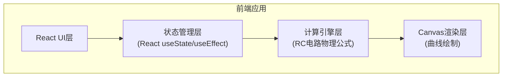

## 1. 架构设计



## 2. 技术描述

- **前端框架**: React@18 + TypeScript
- **构建工具**: Vite@5
- **样式方案**: TailwindCSS@3
- **图表绘制**: 原生 HTML5 Canvas API
- **动画**: CSS Transitions + requestAnimationFrame
- **无后端、无数据库，纯前端单页应用**

## 3. 路由定义

| 路由 | 用途 |
|------|------|
| / | 主页面，包含完整的RC电路模拟器 |

## 4. 核心数据结构

### 4.1 电路参数类型
```typescript
interface CircuitParams {
  resistance: number;      // 电阻 R，单位 kΩ
  capacitance: number;     // 电容 C，单位 μF
  voltage: number;         // 电源电压 V0，单位 V
}

interface CalculationResult {
  tau: number;             // 时间常数 τ = R * C，单位 s
  chargeVoltages: number[]; // 充电曲线电压数组
  dischargeVoltages: number[]; // 放电曲线电压数组
  timePoints: number[];    // 时间点数组
  keyPoints: {             // 关键时间点数据
    tau1: { time: number; chargeV: number; dischargeV: number };
    tau2: { time: number; chargeV: number; dischargeV: number };
    tau3: { time: number; chargeV: number; dischargeV: number };
  };
}

interface Preset {
  id: string;
  name: string;
  description: string;
  params: CircuitParams;
}
```

### 4.2 预设配置
```typescript
const PRESETS: Preset[] = [
  {
    id: 'custom',
    name: '自定义',
    description: '自由调节参数',
    params: { resistance: 10, capacitance: 100, voltage: 12 }
  },
  {
    id: 'low-pass',
    name: '低通滤波器',
    description: '典型音频应用 R=1kΩ, C=1μF',
    params: { resistance: 1, capacitance: 1, voltage: 5 }
  },
  {
    id: 'high-pass',
    name: '高通滤波器',
    description: '典型耦合电路 R=10kΩ, C=10μF',
    params: { resistance: 10, capacitance: 10, voltage: 5 }
  },
  {
    id: 'slow-charge',
    name: '慢速充电',
    description: '大时间常数 R=100kΩ, C=1000μF',
    params: { resistance: 100, capacitance: 1000, voltage: 12 }
  },
  {
    id: 'fast-charge',
    name: '快速充放电',
    description: '小时间常数 R=0.1kΩ, C=0.1μF',
    params: { resistance: 0.1, capacitance: 0.1, voltage: 5 }
  }
];
```

## 5. 核心计算公式

### 5.1 充电公式
$$ V_c(t) = V_0 \times (1 - e^{-t/\tau}) $$

### 5.2 放电公式
$$ V_c(t) = V_0 \times e^{-t/\tau} $$

### 5.3 时间常数
$$ \tau = R \times C $$
- R: 电阻 (Ω)
- C: 电容 (F)
- τ: 时间常数 (s)

### 5.4 单位换算
- R (kΩ) → R (Ω) = R_kΩ × 1000
- C (μF) → C (F) = C_μF × 10⁻⁶
- τ (s) = (R_kΩ × 1000) × (C_μF × 10⁻⁶) = R_kΩ × C_μF × 10⁻³

## 6. 组件架构

```
src/
├── App.tsx                 # 主应用组件
├── main.tsx               # 应用入口
├── index.css              # 全局样式 + Tailwind
├── components/
│   ├── ControlPanel.tsx   # 参数控制面板（滑块组件）
│   ├── RCCurve.tsx        # Canvas曲线绘制组件
│   ├── DataPanel.tsx      # 数据展示面板
│   ├── PresetSelector.tsx # 预设选择器
│   └── Slider.tsx         # 自定义滑块组件
├── utils/
│   ├── calculations.ts    # RC电路计算函数
│   └── canvas.ts          # Canvas绘制工具函数
└── types/
    └── index.ts           # TypeScript类型定义
```

## 7. 关键技术点

1. **Canvas高性能渲染**：使用 requestAnimationFrame 实现流畅的曲线更新动画
2. **实时计算**：参数变化时立即重新计算所有数据点（5τ范围内200个采样点）
3. **响应式Canvas**：监听窗口大小变化，自适应重绘
4. **防抖优化**：滑块拖动时使用 requestAnimationFrame 节流，避免过度重绘
5. **曲线平滑**：使用二次贝塞尔曲线或足够多的采样点确保曲线平滑
