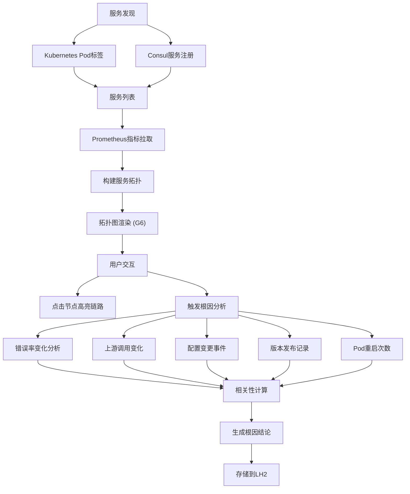

## 1. 产品概述

微服务依赖关系可视化与故障根因分析平台，面向SRE和运维工程师，通过自动采集Prometheus指标、Kubernetes/Consul服务发现数据，构建服务拓扑图并实时监控服务健康状态，当异常发生时自动进行相关性根因分析，帮助快速定位故障源头，缩短MTTR（平均恢复时间）。

- 目标用户：SRE工程师、DevOps运维人员、后端开发工程师
- 核心价值：将复杂的微服务调用关系可视化，自动分析故障根因，减少人工排查时间

## 2. 核心功能

### 2.1 功能模块

1. **拓扑总览页**：服务拓扑图、全局健康状态概览、告警摘要
2. **根因分析页**：异常事件链路展示、多维度相关性分析、建议操作
3. **时间轴对比页**：多服务指标曲线对比、框选联动、历史回溯

### 2.2 页面详情

| 页面名称 | 模块名称 | 功能描述 |
|----------|----------|----------|
| 拓扑总览页 | 服务拓扑图 | 基于AntV G6渲染服务拓扑，节点=服务，边粗细=调用量，边颜色=健康度（绿/黄/红），点击节点高亮上下游链路 |
| 拓扑总览页 | 健康概览面板 | 全局服务健康统计、异常服务列表、实时告警数量 |
| 拓扑总览页 | 服务详情抽屉 | 点击节点展示该服务的请求量、错误率、P99延迟趋势曲线 |
| 根因分析页 | 异常事件时间线 | 按时间排列的异常事件链，展示错误率变化、调用量变化、配置变更、版本发布、Pod重启等 |
| 根因分析页 | 相关性分析面板 | 展示上游服务异常与本服务异常的相关性分析结果，文字链形式给出根因结论和建议 |
| 根因分析页 | 分析历史记录 | 存储到LH2的历史分析结果列表，支持回溯查询 |
| 时间轴对比页 | 多服务指标曲线 | 同时展示多个服务的错误率/延迟/调用量曲线，支持鼠标框选时间范围联动所有图表 |
| 时间轴对比页 | 时间范围选择器 | 全局时间范围控制，框选后联动所有图表缩放 |

## 3. 核心流程

1. 系统通过Kubernetes pod标签和Consul服务注册发现所有微服务实例
2. 从Prometheus拉取服务间调用的请求总数、错误率、P99延迟等metrics
3. 根据调用关系自动构建服务拓扑图，在G6中渲染
4. 用户点击某个服务节点，高亮其上下游调用链路
5. 当某服务异常时，系统自动分析根因：检查自身错误率曲线、上游调用变化、ArgoCD/FluxCD配置变更、版本发布、Pod重启
6. 生成文字链分析结论，如"上游服务 order-api 在 14:23 发布新版本后错误率上升，同时 payment-service 错误率随之上升，建议回滚 order-api"
7. 用户可在时间轴对比视图中框选时间范围，同时查看多个服务的错误率曲线

## 4. 用户界面设计

### 4.1 设计风格

- **主色调**：深色科技风（深蓝灰 #0f172a 为底色，青绿 #22d3ee 为强调色，红色 #ef4444 为告警色）
- **按钮风格**：圆角8px，主按钮用青绿渐变，次要按钮用半透明描边
- **字体**：标题用 JetBrains Mono（等宽科技感），正文用 Inter
- **布局风格**：左侧导航栏 + 主内容区，拓扑图占据大面积空间
- **图标风格**：使用 lucide-react 线性图标

### 4.2 页面设计概览

| 页面名称 | 模块名称 | UI元素 |
|----------|----------|--------|
| 拓扑总览页 | 服务拓扑图 | 全屏深色画布，G6力导向布局，节点圆形带发光效果，边渐变色 |
| 拓扑总览页 | 健康概览面板 | 右侧固定面板，卡片式展示统计数字，带颜色指示灯 |
| 拓扑总览页 | 服务详情抽屉 | 右侧滑出抽屉，内嵌迷你折线图，标签页切换指标 |
| 根因分析页 | 异常事件时间线 | 左侧垂直时间线，每个事件节点带图标和颜色，可展开详情 |
| 根因分析页 | 相关性分析面板 | 右侧面板，文字链结论用高亮色标记关键服务名和时间，建议操作按钮 |
| 时间轴对比页 | 多服务指标曲线 | 多行折线图，每行一个服务，共享X轴时间轴 |
| 时间轴对比页 | 时间范围选择器 | 底部迷你导航图，支持框选高亮 |

### 4.3 响应式

- 桌面优先设计，最小支持1280px宽度
- 拓扑图支持全屏模式
- 时间轴图表自适应容器宽度

### 4.4 3D场景指引

不适用
