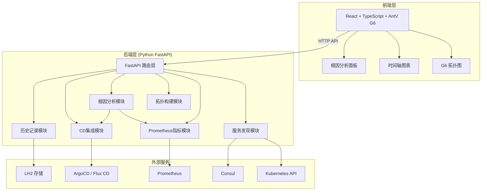
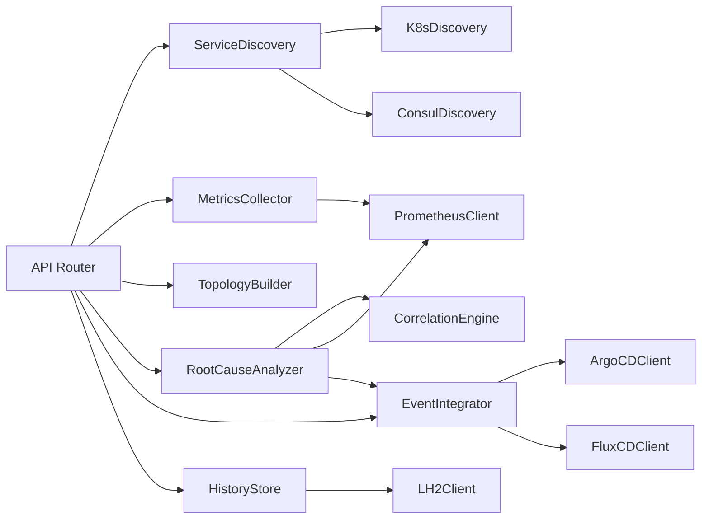
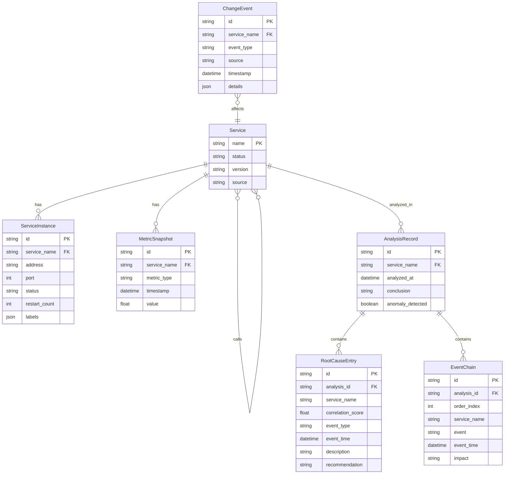

## 1. 架构设计



## 2. 技术说明

- **前端**：React@18 + TypeScript + Vite + TailwindCSS + AntV G6@5 + Zustand
- **初始化工具**：vite-init (react-ts 模板)
- **后端**：Python 3.11 + FastAPI + httpx + pydantic
- **数据库**：LH2（通过HTTP API访问，历史分析记录存储）
- **图表库**：@antv/g6（拓扑图）+ @antv/g2plot 或 echarts（时间轴曲线图）
- **状态管理**：Zustand

## 3. 路由定义

| 路由 | 用途 |
|------|------|
| / | 拓扑总览页 - 服务拓扑图与健康概览 |
| /analysis | 根因分析页 - 异常事件链与相关性分析 |
| /timeline | 时间轴对比页 - 多服务指标曲线对比 |

## 4. API定义

### 4.1 服务发现

```
GET /api/services
Response: {
  services: [{
    name: string
    instances: [{ address: string, port: number, labels: Record<string, string> }]
    source: "kubernetes" | "consul"
  }]
}

GET /api/services/{service_name}/detail
Response: {
  name: string
  instances: [{ address: string, port: number, status: string, restart_count: number }]
  labels: Record<string, string>
  version: string
}
```

### 4.2 拓扑数据

```
GET /api/topology?time_range={start,end}
Response: {
  nodes: [{
    id: string
    name: string
    status: "healthy" | "warning" | "error"
    metrics: { request_count: number, error_rate: number, p99_latency: number }
  }]
  edges: [{
    source: string
    target: string
    call_count: number
    error_rate: number
    avg_latency: number
    health: "healthy" | "warning" | "error"
  }]
}
```

### 4.3 根因分析

```
POST /api/analysis/root-cause
Body: {
  service_name: string
  time_range: { start: datetime, end: datetime }
}
Response: {
  service_name: string
  anomaly_detected: boolean
  root_causes: [{
    service_name: string
    correlation_score: number
    event_type: "error_rate_spike" | "config_change" | "version_release" | "pod_restart" | "traffic_change"
    event_time: datetime
    description: string
    recommendation: string
  }]
  chain: [{
    service_name: string
    event: string
    time: datetime
    impact: string
  }]
  conclusion: string
}
```

### 4.4 时间轴指标

```
GET /api/metrics/timeseries?services={names}&metrics={types}&start={datetime}&end={datetime}&step={string}
Response: {
  series: [{
    service_name: string
    metric_type: "error_rate" | "request_count" | "p99_latency" | "pod_restarts"
    data_points: [{ timestamp: datetime, value: number }]
  }]
}
```

### 4.5 CD事件

```
GET /api/events/changes?service_name={name}&start={datetime}&end={datetime}
Response: {
  events: [{
    service_name: string
    event_type: "config_change" | "version_release"
    source: "argocd" | "fluxcd"
    timestamp: datetime
    details: { old_version: string, new_version: string, config_diff: string }
  }]
}
```

### 4.6 分析历史

```
GET /api/analysis/history?limit={n}&offset={n}
Response: {
  total: number
  records: [{
    id: string
    service_name: string
    conclusion: string
    created_at: datetime
    root_causes: [{ service_name: string, event_type: string, description: string }]
  }]
}
```

## 5. 服务端架构图



## 6. 数据模型

### 6.1 数据模型定义



### 6.2 数据定义语言

```sql
CREATE TABLE service (
    name VARCHAR(255) PRIMARY KEY,
    status VARCHAR(50) DEFAULT 'healthy',
    version VARCHAR(100),
    source VARCHAR(50),
    created_at TIMESTAMP DEFAULT CURRENT_TIMESTAMP,
    updated_at TIMESTAMP DEFAULT CURRENT_TIMESTAMP
);

CREATE TABLE service_instance (
    id VARCHAR(255) PRIMARY KEY,
    service_name VARCHAR(255) REFERENCES service(name),
    address VARCHAR(255),
    port INTEGER,
    status VARCHAR(50),
    restart_count INTEGER DEFAULT 0,
    labels JSONB,
    created_at TIMESTAMP DEFAULT CURRENT_TIMESTAMP
);

CREATE TABLE metric_snapshot (
    id VARCHAR(255) PRIMARY KEY,
    service_name VARCHAR(255) REFERENCES service(name),
    metric_type VARCHAR(50),
    timestamp TIMESTAMP,
    value FLOAT,
    INDEX idx_metric_service_time (service_name, metric_type, timestamp)
);

CREATE TABLE analysis_record (
    id VARCHAR(255) PRIMARY KEY,
    service_name VARCHAR(255) REFERENCES service(name),
    analyzed_at TIMESTAMP DEFAULT CURRENT_TIMESTAMP,
    conclusion TEXT,
    anomaly_detected BOOLEAN DEFAULT FALSE,
    INDEX idx_analysis_service_time (service_name, analyzed_at)
);

CREATE TABLE root_cause_entry (
    id VARCHAR(255) PRIMARY KEY,
    analysis_id VARCHAR(255) REFERENCES analysis_record(id),
    service_name VARCHAR(255),
    correlation_score FLOAT,
    event_type VARCHAR(50),
    event_time TIMESTAMP,
    description TEXT,
    recommendation TEXT
);

CREATE TABLE event_chain (
    id VARCHAR(255) PRIMARY KEY,
    analysis_id VARCHAR(255) REFERENCES analysis_record(id),
    order_index INTEGER,
    service_name VARCHAR(255),
    event TEXT,
    event_time TIMESTAMP,
    impact TEXT
);

CREATE TABLE change_event (
    id VARCHAR(255) PRIMARY KEY,
    service_name VARCHAR(255) REFERENCES service(name),
    event_type VARCHAR(50),
    source VARCHAR(50),
    timestamp TIMESTAMP,
    details JSONB,
    INDEX idx_change_service_time (service_name, timestamp)
);
```
