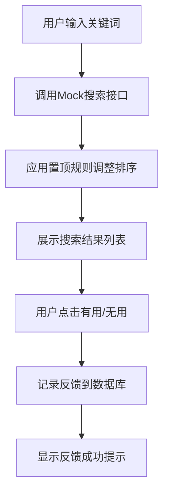
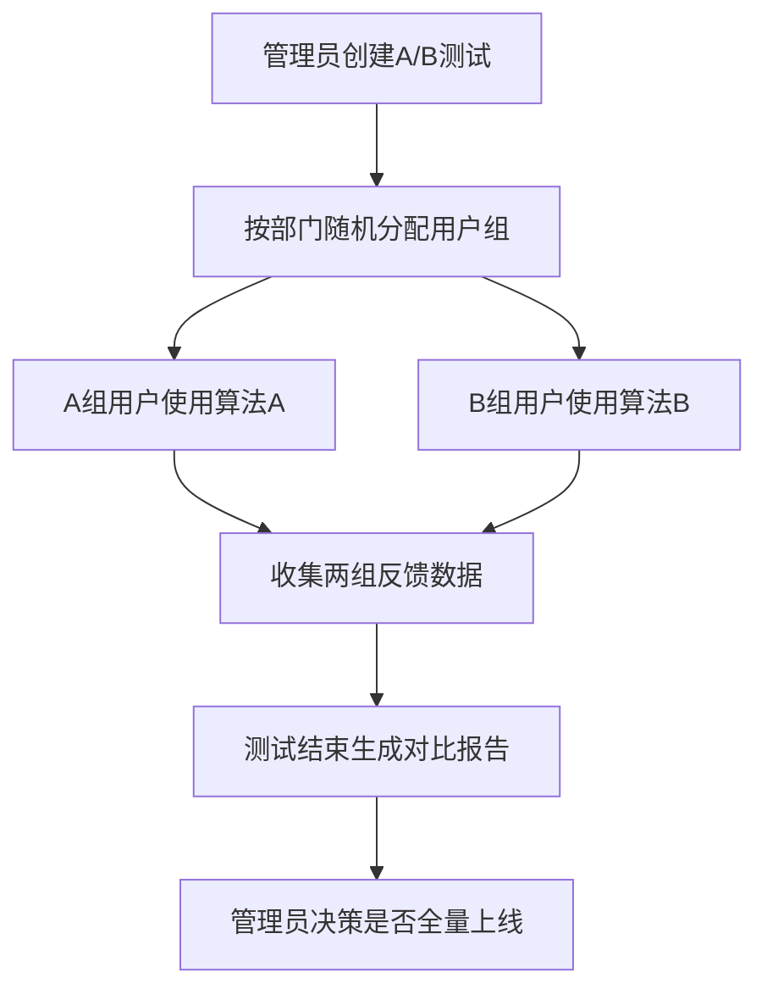
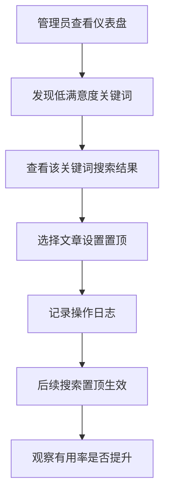

## 1. 产品概述
本平台是内部知识库搜索优化与反馈分析系统，通过收集用户搜索反馈持续提升搜索结果质量，为管理员提供数据驱动的优化决策支持。
- 解决内部知识库搜索结果相关性不足、用户满意度低的问题，通过用户反馈闭环持续优化搜索体验
- 目标用户包括普通员工（搜索使用者）和系统管理员（搜索优化者）

## 2. 核心功能

### 2.1 用户角色
| 角色 | 识别方式 | 核心权限 |
|------|----------|----------|
| 普通用户 | 请求头中的部门信息模拟 | 搜索知识库、对搜索结果提交有用/无用反馈 |
| 系统管理员 | 独立管理员账号登录 | 查看统计报表、配置置顶文章、管理A/B测试、查看操作日志 |

### 2.2 功能模块
1. **搜索页面**：搜索框、搜索结果列表、反馈按钮
2. **管理员仪表盘**：高频低满意度关键词、有用率趋势图、文章满意率排行
3. **置顶管理**：关键词置顶文章配置、置顶历史记录
4. **A/B测试管理**：测试配置、用户分组、效果对比报告
5. **操作日志**：所有配置变更的审计追踪

### 2.3 页面详情
| 页面名称 | 模块名称 | 功能描述 |
|-----------|-------------|---------------------|
| 搜索页面 | 搜索框 | 支持关键词搜索，实时显示搜索结果 |
| 搜索页面 | 结果列表 | 展示文章标题、内容片段、发布时间，支持分页 |
| 搜索页面 | 反馈按钮 | 每个结果旁显示"有用"和"无用"按钮，点击后提交反馈 |
| 仪表盘 | 低满意度关键词 | 表格展示搜索次数≥10且有用率<30%的关键词 |
| 仪表盘 | 有用率趋势 | 折线图展示按天/小时的有用率变化趋势 |
| 仪表盘 | 文章满意率排行 | 柱状图展示Top10高/低满意率文章 |
| 置顶管理 | 置顶配置 | 为指定关键词选择置顶文章，支持取消置顶 |
| A/B测试 | 测试列表 | 查看历史和进行中的A/B测试，包含算法A/B对比数据 |
| A/B测试 | 新建测试 | 配置测试名称、算法A、算法B、开始/结束时间 |
| A/B测试 | 测试报告 | 展示两组用户的有用率、点击率、置信度分析 |
| 操作日志 | 日志列表 | 按时间倒序展示所有配置变更，支持筛选和导出 |

## 3. 核心流程

### 3.1 用户搜索与反馈流程
用户在搜索框输入关键词 → 系统调用Mock搜索接口返回结果 → 应用置顶规则调整排序 → 展示搜索结果列表 → 用户点击"有用"或"无用" → 记录反馈数据到SQLite → 显示反馈成功提示

### 3.2 A/B测试流程
管理员创建测试配置 → 系统按部门随机分配用户到A/B组 → 用户搜索时应用对应算法 → 收集两组用户反馈数据 → 测试结束后生成对比报告 → 管理员决定是否全量上线优胜算法

### 3.3 管理员优化流程
管理员查看仪表盘 → 发现低满意度关键词 → 查看该关键词的搜索结果 → 选择合适文章设置置顶 → 系统记录操作日志 → 后续搜索该关键词时置顶文章排第一位 → 持续观察有用率变化

## 4. 用户界面设计

### 4.1 设计风格
- **主色调**：专业蓝 #165DFF，代表企业级产品的稳重与可信赖
- **辅助色**：成功绿 #00B42A（有用）、警告橙 #FF7D00（无用）、中性灰 #4E5969
- **按钮风格**：圆角8px，轻微阴影，hover时上浮2px的微交互
- **字体**：标题使用 Noto Sans SC Bold，正文使用 Noto Sans SC Regular
- **布局风格**：卡片式布局，顶部导航栏 + 左侧菜单（管理员后台），充足留白
- **图标风格**：线性图标，粗细1.5px，统一圆角风格

### 4.2 页面设计概述
| 页面名称 | 模块名称 | UI元素 |
|-----------|-------------|-------------|
| 搜索页面 | 搜索框 | 居中大搜索框，圆角12px，输入时边框高亮，带搜索图标 |
| 搜索页面 | 结果卡片 | 白色背景，浅灰边框，hover时边框变蓝，显示文章标题、片段、时间、反馈按钮 |
| 搜索页面 | 反馈按钮 | 并排的👍有用和👎无用按钮，点击后变灰禁用，显示感谢提示 |
| 仪表盘 | 统计卡片 | 4个顶部概览卡片：今日搜索量、总反馈数、平均有用率、进行中A/B测试数 |
| 仪表盘 | 低满意度表格 | 斑马纹表格，关键词红色高亮，操作列有"设置置顶"按钮 |
| 仪表盘 | 趋势图 | ECharts折线图，支持切换天/小时视图，数据点hover显示详情 |
| 仪表盘 | 排行图 | ECharts横向柱状图，绿色为高满意率，红色为低满意率 |
| A/B测试 | 对比卡片 | 左右两列对比算法A和B的指标数据，优胜指标绿色高亮 |
| 操作日志 | 时间线 | 左侧时间轴，右侧操作详情，不同操作类型用不同颜色标记 |

### 4.3 响应式
- 桌面端优先设计，搜索结果页在≥1280px宽度下三列展示卡片
- 平板端（768px-1279px）两列展示，侧边栏收起为图标
- 移动端（<768px）单列展示，顶部导航简化，图表支持触摸滑动
- 所有交互元素最小尺寸44x44px，适配触摸操作

## 5. 非功能性需求

### 5.1 性能要求
- 搜索响应时间 < 500ms（含Mock接口调用）
- 反馈提交响应时间 < 200ms
- 图表加载时间 < 1s
- 支持并发用户数 ≥ 100

### 5.2 数据安全
- 用户部门信息从请求头获取，不存储敏感个人信息
- 操作日志不可篡改，仅支持查询不支持修改删除
- 数据库定期备份，保留30天历史数据

### 5.3 可扩展性
- 搜索算法支持插件式扩展，便于后续接入真实知识库
- 报表支持自定义时间范围和维度筛选
- A/B测试支持多算法并行测试
