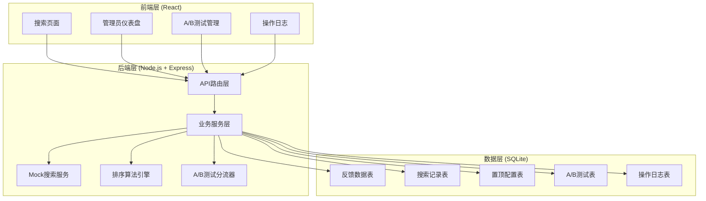
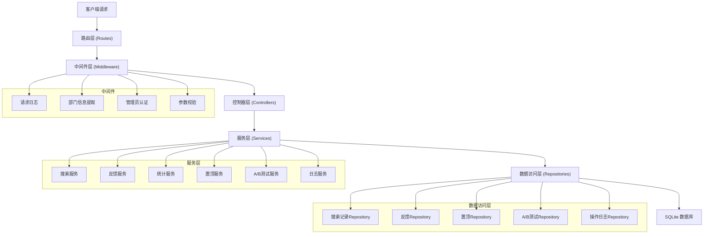
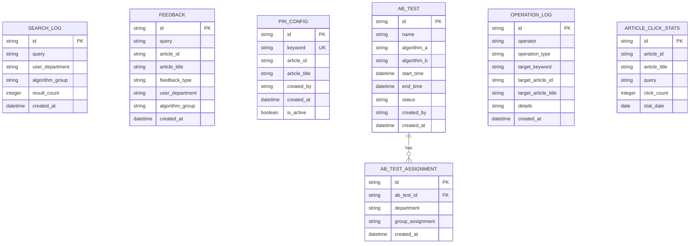

## 1. 架构设计

本平台采用前后端分离架构，后端提供RESTful API，前端使用React构建单页应用。所有数据存储在SQLite数据库中，无需额外的外部服务依赖。



## 2. 技术描述

- **前端**：React@18 + TypeScript + React Router@6 + TailwindCSS@3 + ECharts@5 + Vite@5
- **后端**：Node.js@18 + Express@4 + TypeScript
- **数据库**：SQLite3 + better-sqlite3
- **ORM**：无原生ORM，使用参数化SQL查询防止注入
- **初始化工具**：Vite初始化前端项目，npm初始化后端项目

### 技术选型理由
1. **React + TypeScript**：保证类型安全，提升代码可维护性
2. **TailwindCSS**：快速构建UI，减少自定义CSS
3. **ECharts**：功能强大的图表库，支持折线图、柱状图等多种图表
4. **Express**：轻量级Web框架，适合中小型项目
5. **SQLite + better-sqlite3**：零配置数据库，同步API性能优异，适合单节点部署
6. **better-sqlite3**：比sqlite3包性能更好，API更简洁

## 3. 路由定义

### 前端路由
| 路由路径 | 页面名称 | 权限要求 |
|----------|----------|----------|
| / | 搜索首页 | 所有用户 |
| /search?q=xxx | 搜索结果页 | 所有用户 |
| /admin | 管理员仪表盘 | 管理员 |
| /admin/pin | 置顶管理 | 管理员 |
| /admin/abtest | A/B测试列表 | 管理员 |
| /admin/abtest/new | 新建A/B测试 | 管理员 |
| /admin/abtest/:id | A/B测试详情/报告 | 管理员 |
| /admin/logs | 操作日志 | 管理员 |
| /admin/login | 管理员登录 | 公开 |

### 后端API路由
| Method | Path | 用途 |
|--------|------|------|
| GET | /api/search | 搜索知识库 |
| POST | /api/feedback | 提交用户反馈 |
| GET | /api/admin/stats/overview | 获取统计概览 |
| GET | /api/admin/stats/low-satisfaction-keywords | 获取低满意度关键词 |
| GET | /api/admin/stats/satisfaction-trend | 获取有用率趋势 |
| GET | /api/admin/stats/article-ranking | 获取文章满意率排行 |
| GET | /api/admin/pin | 获取置顶配置列表 |
| POST | /api/admin/pin | 设置置顶文章 |
| DELETE | /api/admin/pin/:id | 取消置顶 |
| GET | /api/admin/abtest | 获取A/B测试列表 |
| POST | /api/admin/abtest | 创建A/B测试 |
| GET | /api/admin/abtest/:id | 获取A/B测试详情 |
| GET | /api/admin/abtest/:id/report | 获取A/B测试报告 |
| PUT | /api/admin/abtest/:id/status | 更新A/B测试状态 |
| GET | /api/admin/logs | 获取操作日志 |
| POST | /api/admin/login | 管理员登录 |

## 4. API Definitions

### 类型定义

```typescript
// 知识库文章
interface Article {
  id: string;
  title: string;
  contentSnippet: string;
  publishTime: string;
  url?: string;
}

// 搜索结果
interface SearchResult {
  articles: Article[];
  total: number;
  query: string;
  pinnedArticle?: Article;
  algorithm?: 'A' | 'B';
}

// 反馈数据
interface Feedback {
  id: string;
  query: string;
  articleId: string;
  articleTitle: string;
  feedbackType: 'useful' | 'useless';
  timestamp: string;
  userDepartment: string;
  algorithmGroup?: 'A' | 'B';
}

// 置顶配置
interface PinConfig {
  id: string;
  keyword: string;
  articleId: string;
  articleTitle: string;
  createdBy: string;
  createdAt: string;
  isActive: boolean;
}

// A/B测试
interface ABTest {
  id: string;
  name: string;
  algorithmA: string;
  algorithmB: string;
  startTime: string;
  endTime?: string;
  status: 'draft' | 'running' | 'completed';
  createdBy: string;
  createdAt: string;
}

// A/B测试报告
interface ABTestReport {
  testId: string;
  groupAStats: {
    totalSearches: number;
    totalFeedbacks: number;
    usefulRate: number;
    clickThroughRate: number;
  };
  groupBStats: {
    totalSearches: number;
    totalFeedbacks: number;
    usefulRate: number;
    clickThroughRate: number;
  };
  winner: 'A' | 'B' | 'tie';
  confidence: number;
}

// 操作日志
interface OperationLog {
  id: string;
  operator: string;
  operationType: 'pin_set' | 'pin_remove' | 'abtest_create' | 'abtest_start' | 'abtest_stop';
  targetKeyword?: string;
  targetArticleId?: string;
  targetArticleTitle?: string;
  details: string;
  timestamp: string;
}
```

### 请求/响应示例

#### 搜索接口
```
GET /api/search?q=VPN配置
Headers: X-User-Department: 技术部
```
响应：
```json
{
  "articles": [
    {
      "id": "art_001",
      "title": "VPN配置完全指南",
      "contentSnippet": "本文详细介绍了公司VPN的安装和配置步骤...",
      "publishTime": "2026-05-15T10:30:00Z"
    }
  ],
  "total": 15,
  "query": "VPN配置",
  "algorithm": "A"
}
```

#### 提交反馈
```
POST /api/feedback
Headers: X-User-Department: 技术部
Body:
{
  "query": "VPN配置",
  "articleId": "art_001",
  "articleTitle": "VPN配置完全指南",
  "feedbackType": "useful"
}
```
响应：
```json
{
  "success": true,
  "message": "反馈已记录，感谢您的评价！"
}
```

## 5. 服务器架构图

后端采用经典的三层架构，各层职责清晰，便于维护和扩展。



## 6. 数据模型

### 6.1 数据模型定义



### 6.2 数据定义语言 (DDL)

```sql
-- 搜索记录表
CREATE TABLE IF NOT EXISTS search_log (
    id TEXT PRIMARY KEY,
    query TEXT NOT NULL,
    user_department TEXT NOT NULL,
    algorithm_group TEXT,
    result_count INTEGER DEFAULT 0,
    created_at DATETIME DEFAULT CURRENT_TIMESTAMP
);

CREATE INDEX IF NOT EXISTS idx_search_log_query ON search_log(query);
CREATE INDEX IF NOT EXISTS idx_search_log_department ON search_log(user_department);
CREATE INDEX IF NOT EXISTS idx_search_log_created_at ON search_log(created_at);

-- 反馈记录表
CREATE TABLE IF NOT EXISTS feedback (
    id TEXT PRIMARY KEY,
    query TEXT NOT NULL,
    article_id TEXT NOT NULL,
    article_title TEXT NOT NULL,
    feedback_type TEXT NOT NULL CHECK(feedback_type IN ('useful', 'useless')),
    user_department TEXT NOT NULL,
    algorithm_group TEXT,
    created_at DATETIME DEFAULT CURRENT_TIMESTAMP
);

CREATE INDEX IF NOT EXISTS idx_feedback_query ON feedback(query);
CREATE INDEX IF NOT EXISTS idx_feedback_article ON feedback(article_id);
CREATE INDEX IF NOT EXISTS idx_feedback_type ON feedback(feedback_type);
CREATE INDEX IF NOT EXISTS idx_feedback_created_at ON feedback(created_at);

-- 置顶配置表
CREATE TABLE IF NOT EXISTS pin_config (
    id TEXT PRIMARY KEY,
    keyword TEXT UNIQUE NOT NULL,
    article_id TEXT NOT NULL,
    article_title TEXT NOT NULL,
    created_by TEXT NOT NULL,
    created_at DATETIME DEFAULT CURRENT_TIMESTAMP,
    is_active BOOLEAN DEFAULT 1
);

CREATE INDEX IF NOT EXISTS idx_pin_config_keyword ON pin_config(keyword);
CREATE INDEX IF NOT EXISTS idx_pin_config_active ON pin_config(is_active);

-- A/B测试表
CREATE TABLE IF NOT EXISTS ab_test (
    id TEXT PRIMARY KEY,
    name TEXT NOT NULL,
    algorithm_a TEXT NOT NULL DEFAULT 'default',
    algorithm_b TEXT NOT NULL DEFAULT 'click_weighted',
    start_time DATETIME,
    end_time DATETIME,
    status TEXT NOT NULL DEFAULT 'draft' CHECK(status IN ('draft', 'running', 'completed')),
    created_by TEXT NOT NULL,
    created_at DATETIME DEFAULT CURRENT_TIMESTAMP
);

CREATE INDEX IF NOT EXISTS idx_ab_test_status ON ab_test(status);
CREATE INDEX IF NOT EXISTS idx_ab_test_created_at ON ab_test(created_at);

-- A/B测试用户分配表
CREATE TABLE IF NOT EXISTS ab_test_assignment (
    id TEXT PRIMARY KEY,
    ab_test_id TEXT NOT NULL,
    department TEXT NOT NULL,
    group_assignment TEXT NOT NULL CHECK(group_assignment IN ('A', 'B')),
    created_at DATETIME DEFAULT CURRENT_TIMESTAMP,
    FOREIGN KEY (ab_test_id) REFERENCES ab_test(id) ON DELETE CASCADE,
    UNIQUE(ab_test_id, department)
);

-- 操作日志表
CREATE TABLE IF NOT EXISTS operation_log (
    id TEXT PRIMARY KEY,
    operator TEXT NOT NULL,
    operation_type TEXT NOT NULL,
    target_keyword TEXT,
    target_article_id TEXT,
    target_article_title TEXT,
    details TEXT NOT NULL,
    created_at DATETIME DEFAULT CURRENT_TIMESTAMP
);

CREATE INDEX IF NOT EXISTS idx_operation_log_operator ON operation_log(operator);
CREATE INDEX IF NOT EXISTS idx_operation_log_type ON operation_log(operation_type);
CREATE INDEX IF NOT EXISTS idx_operation_log_created_at ON operation_log(created_at);

-- 文章点击统计表
CREATE TABLE IF NOT EXISTS article_click_stats (
    id TEXT PRIMARY KEY,
    article_id TEXT NOT NULL,
    article_title TEXT NOT NULL,
    query TEXT NOT NULL,
    click_count INTEGER DEFAULT 0,
    stat_date DATE NOT NULL,
    UNIQUE(article_id, query, stat_date)
);

CREATE INDEX IF NOT EXISTS idx_click_stats_article ON article_click_stats(article_id);
CREATE INDEX IF NOT EXISTS idx_click_stats_date ON article_click_stats(stat_date);

-- 初始化管理员账号 (密码: admin123)
INSERT OR IGNORE INTO pin_config (id, keyword, article_id, article_title, created_by, is_active)
VALUES ('init_pin', '', '', '', 'system', 0);
```

### 6.3 搜索排序算法

#### 算法A：默认相关度排序
```typescript
function algorithmDefault(articles: Article[], query: string): Article[] {
  return articles.sort((a, b) => {
    const scoreA = calculateRelevance(a, query);
    const scoreB = calculateRelevance(b, query);
    return scoreB - scoreA;
  });
}

function calculateRelevance(article: Article, query: string): number {
  const titleMatch = article.title.toLowerCase().includes(query.toLowerCase()) ? 10 : 0;
  const snippetMatch = article.contentSnippet.toLowerCase().includes(query.toLowerCase()) ? 5 : 0;
  const queryWords = query.toLowerCase().split(/\s+/);
  const wordMatches = queryWords.filter(word => 
    article.title.toLowerCase().includes(word) || 
    article.contentSnippet.toLowerCase().includes(word)
  ).length;
  return titleMatch + snippetMatch + wordMatches * 2;
}
```

#### 算法B：按点击率加权排序
```typescript
function algorithmClickWeighted(
  articles: Article[], 
  query: string, 
  clickStats: Map<string, number>
): Article[] {
  return articles.sort((a, b) => {
    const relevanceA = calculateRelevance(a, query);
    const relevanceB = calculateRelevance(b, query);
    const clicksA = clickStats.get(`${a.id}:${query}`) || 0;
    const clicksB = clickStats.get(`${b.id}:${query}`) || 0;
    const scoreA = relevanceA * 0.6 + Math.log10(clicksA + 1) * 10 * 0.4;
    const scoreB = relevanceB * 0.6 + Math.log10(clicksB + 1) * 10 * 0.4;
    return scoreB - scoreA;
  });
}
```

### 6.4 Mock知识库数据

预置20篇常用知识库文章，涵盖IT、HR、财务等多个部门常见问题：

```typescript
const MOCK_ARTICLES: Article[] = [
  {
    id: 'art_001',
    title: 'VPN配置完全指南',
    contentSnippet: '本文详细介绍了公司VPN的安装和配置步骤，支持Windows、macOS和移动端...',
    publishTime: '2026-05-15T10:30:00Z'
  },
  {
    id: 'art_002',
    title: '企业邮箱客户端配置教程',
    contentSnippet: '如何在Outlook、Foxmail和手机邮箱中配置公司企业邮箱账户...',
    publishTime: '2026-05-10T14:20:00Z'
  },
  // ... 更多Mock文章
];
```
