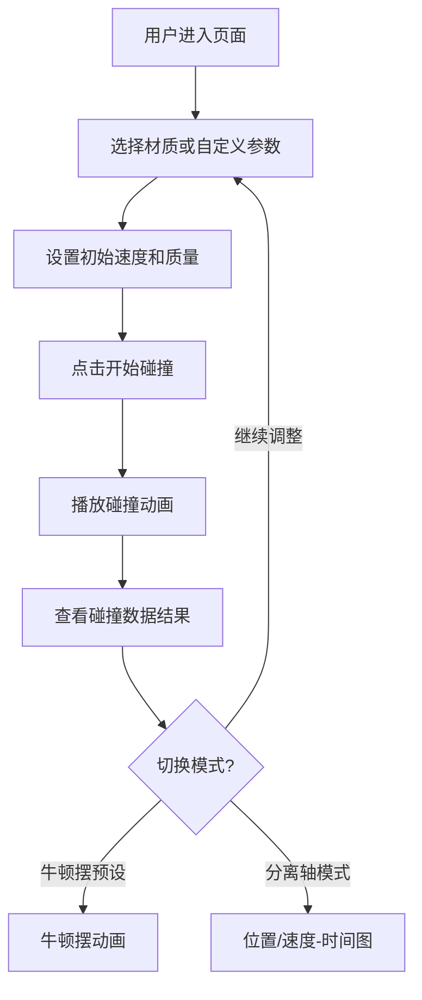

## 1. 产品概述
碰撞恢复系数测量模拟器——一款面向物理教学与实验的可视化交互工具，通过一维对心碰撞动画直观展示不同材质碰撞的恢复系数、动量守恒与动能损失，帮助用户理解碰撞物理的核心概念。
- 目标用户：中学/大学物理教师、学生、物理爱好者
- 核心价值：将抽象的碰撞恢复系数概念转化为可操作、可观察的交互式实验

## 2. 核心功能

### 2.1 用户角色
无需角色区分，所有用户享有完整功能。

### 2.2 功能模块
1. **碰撞模拟主页面**：参数控制面板、Canvas碰撞动画、数据结果面板、牛顿摆预设

### 2.3 页面详情
| 页面名称 | 模块名称 | 功能描述 |
|----------|----------|----------|
| 碰撞模拟主页 | 参数控制面板 | 选择两球材质（橡胶/钢/玻璃/自定义），自动加载恢复系数预设值，手动输入v1/v2/m1/m2，支持自定义恢复系数(0-1) |
| 碰撞模拟主页 | 碰撞动画区 | Canvas绘制一维对心碰撞全过程：两球相向移动→接触→变形→反弹，支持播放/暂停/重置 |
| 碰撞模拟主页 | 数据结果面板 | 碰撞前后速度对比、动能损失百分比、动量守恒验证（前后总动量差值） |
| 碰撞模拟主页 | 牛顿摆预设 | 一键切换至牛顿摆（法拉第摆）简化模拟，展示多球碰撞传递效果 |
| 碰撞模拟主页 | 分离轴模式 | 在独立坐标轴上分别显示位置-时间图和速度-时间图 |

## 3. 核心流程

用户进入页面 → 选择材质或自定义参数 → 设置初始速度和质量 → 点击"开始碰撞" → 观看碰撞动画 → 查看数据结果 → 可切换牛顿摆预设或分离轴模式

## 4. 用户界面设计

### 4.1 设计风格
- 主色调：深蓝黑色背景(#0a0e1a) + 青色高光(#00e5ff) + 橙色对比(#ff6b35)
- 按钮风格：圆角胶囊按钮，带微妙渐变与hover发光效果
- 字体：JetBrains Mono（数据）+ Space Grotesk（标题）+ 系统无衬线（正文）
- 布局：左侧控制面板 + 中间Canvas动画区 + 右侧数据面板
- 图标：lucide-react图标集
- 整体风格：科学仪器/实验室仪表盘风格，暗色主题，网格背景线

### 4.2 页面设计概述
| 页面名称 | 模块名称 | UI元素 |
|----------|----------|--------|
| 碰撞模拟主页 | 参数控制面板 | 材质选择卡片（带图标）、数值输入滑块+数字框、恢复系数滑块（带刻度）、开始/暂停/重置按钮 |
| 碰撞模拟主页 | 碰撞动画区 | 深色Canvas背景+网格线、发光球体动画、碰撞火花特效、速度向量箭头 |
| 碰撞模拟主页 | 数据结果面板 | 碰撞前后速度表、动能柱状对比图、动量守恒验证指示器（绿色✓/红色✗） |
| 碰撞模拟主页 | 牛顿摆预设 | 5球牛顿摆Canvas动画、摆线绘制、一键启动 |
| 碰撞模拟主页 | 分离轴模式 | 位置-时间图、速度-时间图（Chart.js或Canvas自绘） |

### 4.3 响应式
桌面优先设计，Canvas动画区占据主要空间，侧边面板在小屏幕下折叠为底部抽屉

### 4.4 3D场景指引
不适用，本项目使用2D Canvas渲染
