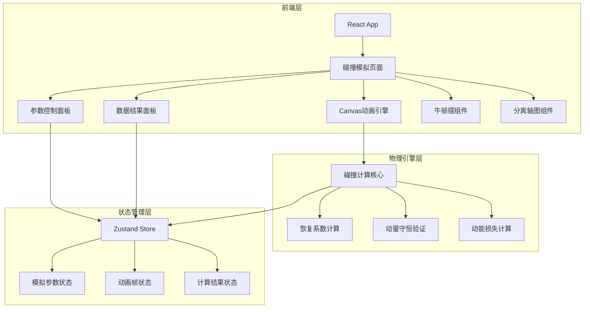
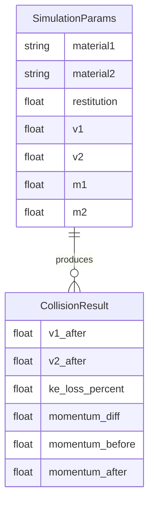

## 1. 架构设计



## 2. 技术说明
- 前端：React@18 + TypeScript + Tailwind CSS@3 + Vite
- 初始化工具：vite-init
- 后端：无（纯前端应用）
- 数据库：无（所有计算在浏览器端完成）
- 状态管理：Zustand
- 动画渲染：Canvas 2D API（requestAnimationFrame）
- 图表：Canvas自绘（轻量无依赖）

## 3. 路由定义
| 路由 | 用途 |
|------|------|
| / | 碰撞模拟主页面（单页应用） |

## 4. API定义
无后端API，所有物理计算在前端完成。

### 4.1 核心物理公式

**恢复系数计算（碰撞后速度）：**
- v1' = (m1*v1 + m2*v2 - m2*e*(v1-v2)) / (m1+m2)
- v2' = (m1*v1 + m2*v2 + m1*e*(v1-v2)) / (m1+m2)

**动量守恒验证：**
- Δp = |(m1*v1'+m2*v2') - (m1*v1+m2*v2)|

**动能损失百分比：**
- KE_loss% = (1 - (0.5*m1*v1'²+0.5*m2*v2'²) / (0.5*m1*v1²+0.5*m2*v2²)) * 100

### 4.2 材质预设值
| 材质 | 恢复系数e |
|------|-----------|
| 橡胶 | 0.82 |
| 钢 | 0.60 |
| 玻璃 | 0.70 |
| 自定义 | 用户输入(0-1) |

## 5. 服务器架构图
不适用（纯前端应用）

## 6. 数据模型

### 6.1 数据模型定义


### 6.2 状态结构（Zustand Store）
```typescript
interface SimulationState {
  material1: 'rubber' | 'steel' | 'glass' | 'custom'
  material2: 'rubber' | 'steel' | 'glass' | 'custom'
  restitution: number
  v1: number
  v2: number
  m1: number
  m2: number
  isRunning: boolean
  result: CollisionResult | null
  mode: 'collision' | 'newton-cradle' | 'separated-axis'
}
```
